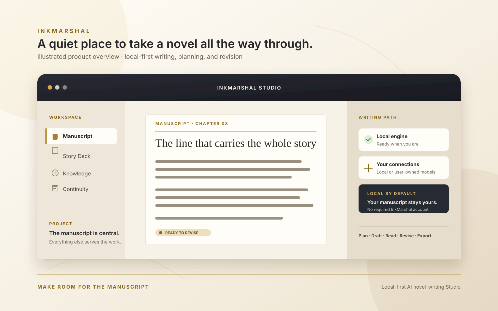
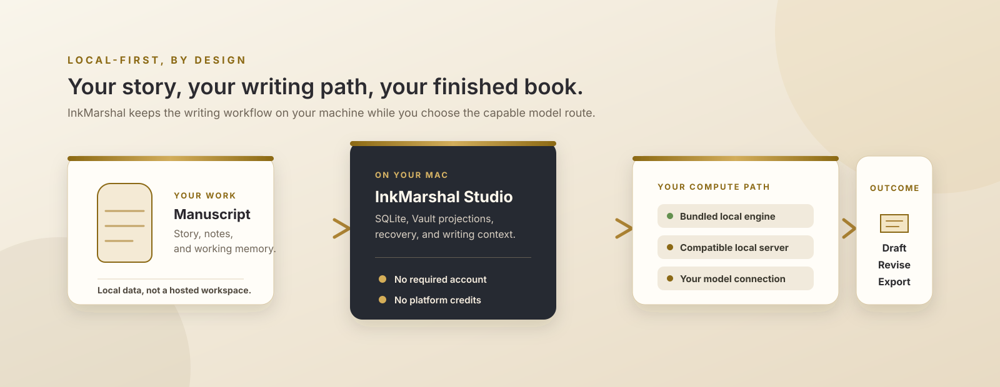

<p align="center">
  
</p>

<h1 align="center">InkMarshal</h1>

<p align="center">
  <strong>本地优先的 AI 小说创作 Studio</strong><br>
  从构思、写作到修订与导出，把长篇小说完整留在自己的工作流里。
</p>

<p align="center">
  <a href="#下载">下载 macOS 版</a> ·
  <a href="#从源码运行">从源码运行</a> ·
  <a href="README.md">English</a>
</p>

<p align="center">
  
</p>

InkMarshal 是基于 Tauri v2 的本地优先桌面写作环境。它把访谈、故事设定、章节起草、连续性、修订与导出连成一条长篇创作路径；手稿保存在本机 SQLite，可使用内置引擎、兼容的本地服务或自己的模型连接，无需 InkMarshal 云账号。

## 为一部长篇小说而设计

| 搭好故事 | 写下手稿 | 完成本书 |
| --- | --- | --- |
| 从访谈推进到故事结构、大纲、知识与项目目标。 | 以连续性记忆和质量反馈支持可恢复的章节写作。 | 阅读、编辑、定向改写、快照、恢复、全书统一、备份与导出。 |

<p align="center">
  
</p>

## 你的作品，由你掌控

- **默认在本机。** 手稿、设置、模型、日志和 Vault 投影都留在你的电脑上。
- **算力由你选择。** 内置本地引擎优先，也可在需要时使用兼容本地服务或自己的模型连接。
- **没有平台阻碍。** 写作不要求账号、云端手稿数据库或平台积分。

## 下载

**[下载最新版已签名、公证的 Apple Silicon macOS 版本](https://github.com/mike007jd/InkMarshal/releases/latest)**

其他平台只有在完成签名与真实验证后才会公开发布。

## 从源码运行

```bash
git clone https://github.com/mike007jd/InkMarshal.git
cd InkMarshal/novelcraft-ai
corepack enable
pnpm install --frozen-lockfile
pnpm desktop:dev
```

请使用项目声明的 Node 与 pnpm 版本。完整工具链、命令、质量门禁和本地数据安全规则见英文 [CONTRIBUTING.md](CONTRIBUTING.md)。

## 文档

- 总索引：[docs/README.md](docs/README.md)
- 隐私：[PRIVACY.md](PRIVACY.md)
- 安全：[SECURITY.md](SECURITY.md)
- 开发上手：[CONTRIBUTING.md](CONTRIBUTING.md)
- 第三方归属：[THIRD_PARTY_NOTICES.md](THIRD_PARTY_NOTICES.md)

开发、设计、发布和 agent 文档统一使用英文；本文件是面向用户的中文简介。
